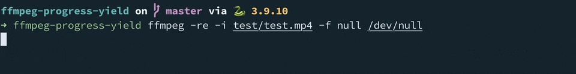

# ffmpeg-progress-yield
<!-- ALL-CONTRIBUTORS-BADGE:START - Do not remove or modify this section -->
[](#contributors-)
<!-- ALL-CONTRIBUTORS-BADGE:END -->

[](https://pypi.org/project/ffmpeg-progress-yield) [](https://github.com/slhck/ffmpeg-progress-yield/actions/workflows/python-package.yml)

Run an ffmpeg command with its progress yielded.



Contents:

- [Requirements](#requirements)
- [Installation](#installation)
- [Usage](#usage)
  - [As a library](#as-a-library)
  - [On the command line](#on-the-command-line)
- [Caveats](#caveats)
- [Contributors](#contributors)
- [License](#license)

-------------

## Requirements

-   Python 3.8 or higher
-   ffmpeg v3.1 or above from <http://ffmpeg.org/> installed in your \$PATH

## Installation

    pip3 install ffmpeg-progress-yield

Or download this repository, then run `pip install .`.

## Usage

### As a library

In your Python project, import the helper class and run `run_command_with_progress`.

For more information see the [API documentation](https://htmlpreview.github.io/?https://github.com/slhck/ffmpeg-progress-yield/blob/master/docs/ffmpeg_progress_yield.html).

Example:

```python
from ffmpeg_progress_yield import FfmpegProgress

cmd = [
    "ffmpeg", "-i", "test/test.mp4", "-c:v", "libx264", "-vf", "scale=1920x1080", "-preset", "fast", "-f", "null", "/dev/null",
]

ff = FfmpegProgress(cmd)
for progress in ff.run_command_with_progress():
    print(f"{progress}/100")
```

The command will yield the current progress in percent as a float number.

`run_command_with_progress` takes a `duration_override` argument where you can manually override the duration of the command in seconds. This is useful if your input doesn't have an implicit duration (e.g. if you use `testsrc`).

If you have `tqdm` installed, you can create a fancy progress bar:

```python
from tqdm import tqdm
from ffmpeg_progress_yield import FfmpegProgress

cmd = [
    "ffmpeg", "-i", "test/test.mp4", "-c:v", "libx264", "-vf", "scale=1920x1080", "-preset", "fast", "-f", "null", "/dev/null",
]

ff = FfmpegProgress(cmd)
with tqdm(total=100, position=1, desc="Test") as pbar:
    for progress in ff.run_command_with_progress():
        pbar.update(progress - pbar.n)

# get the output
print(ff.stderr)
```

You can also quit the command by calling `.quit()`:

```python
ff = FfmpegProgress(cmd)
for progress in ff.run_command_with_progress():
    if progress > 50:
        ff.quit()
        break
```

This will send a hard quit to the ffmpeg process, and may not wait for it to finish. To quit gracefully, use `.quit_gracefully()` instead, which sends 'q' to the ffmpeg process, and waits for it to finish.

This is probably most useful in asynchronous environments, where you can run the command in a separate thread, and quit it from the main thread (e.g. using a [Condition Variable](https://docs.python.org/3/library/threading.html#threading.Condition)).

### On the command line

Simply prefix your ffmpeg command with `ffmpeg-progress-yield`:

```bash
ffmpeg-progress-yield ffmpeg -i input.mp4 output.mp4
```

It will show a progress bar, and once the command is done, show the ffmpeg stderr output.

If you want to manually override the duration to, say, 12.5 seconds (e.g. because your input doesn't have an implicit one):

```bash
ffmpeg-progress-yield --duration 12.5 ffmpeg -f lavfi -i testsrc -t 12.5 output.mp4
```

## Caveats

Currently, we do not differentiate between `stderr` and `stdout`. This means progress will be mixed with the ffmpeg log.

You can also check out [`ffmpeg-progress`](https://github.com/Tatsh/ffmpeg-progress) for a similar project with a different feature set.

## Contributors

<!-- ALL-CONTRIBUTORS-LIST:START - Do not remove or modify this section -->
<!-- prettier-ignore-start -->
<!-- markdownlint-disable -->
<table>
  <tbody>
    <tr>
      <td align="center" valign="top" width="14.28%"><a href="http://slhck.info/"><br /><sub><b>Werner Robitza</b></sub></a><br /><a href="https://github.com/slhck/ffmpeg-progress-yield/commits?author=slhck" title="Code">💻</a></td>
      <td align="center" valign="top" width="14.28%"><a href="https://github.com/WyattBlue"><br /><sub><b>WyattBlue</b></sub></a><br /><a href="https://github.com/slhck/ffmpeg-progress-yield/commits?author=WyattBlue" title="Code">💻</a></td>
      <td align="center" valign="top" width="14.28%"><a href="https://github.com/kskadart"><br /><sub><b>Kirill Konovalov</b></sub></a><br /><a href="https://github.com/slhck/ffmpeg-progress-yield/commits?author=kskadart" title="Code">💻</a></td>
      <td align="center" valign="top" width="14.28%"><a href="https://github.com/ammgws"><br /><sub><b>Jason Nader</b></sub></a><br /><a href="https://github.com/slhck/ffmpeg-progress-yield/issues?q=author%3Aammgws" title="Bug reports">🐛</a></td>
      <td align="center" valign="top" width="14.28%"><a href="https://github.com/LaunchLee"><br /><sub><b>Launch Lee</b></sub></a><br /><a href="https://github.com/slhck/ffmpeg-progress-yield/commits?author=LaunchLee" title="Code">💻</a></td>
    </tr>
  </tbody>
  <tfoot>
    <tr>
      <td align="center" size="13px" colspan="7">
        
          <a href="https://all-contributors.js.org/docs/en/bot/usage">Add your contributions</a>
        </img>
      </td>
    </tr>
  </tfoot>
</table>

<!-- markdownlint-restore -->
<!-- prettier-ignore-end -->

<!-- ALL-CONTRIBUTORS-LIST:END -->

## License

The MIT License (MIT)

Copyright (c) 2021-2023 Werner Robitza

Permission is hereby granted, free of charge, to any person obtaining a copy
of this software and associated documentation files (the "Software"), to deal
in the Software without restriction, including without limitation the rights
to use, copy, modify, merge, publish, distribute, sublicense, and/or sell
copies of the Software, and to permit persons to whom the Software is
furnished to do so, subject to the following conditions:

The above copyright notice and this permission notice shall be included in all
copies or substantial portions of the Software.

THE SOFTWARE IS PROVIDED "AS IS", WITHOUT WARRANTY OF ANY KIND, EXPRESS OR
IMPLIED, INCLUDING BUT NOT LIMITED TO THE WARRANTIES OF MERCHANTABILITY,
FITNESS FOR A PARTICULAR PURPOSE AND NONINFRINGEMENT. IN NO EVENT SHALL THE
AUTHORS OR COPYRIGHT HOLDERS BE LIABLE FOR ANY CLAIM, DAMAGES OR OTHER
LIABILITY, WHETHER IN AN ACTION OF CONTRACT, TORT OR OTHERWISE, ARISING FROM,
OUT OF OR IN CONNECTION WITH THE SOFTWARE OR THE USE OR OTHER DEALINGS IN THE
SOFTWARE.
